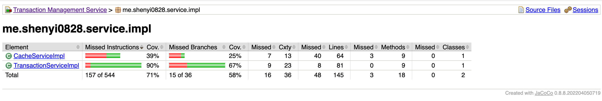
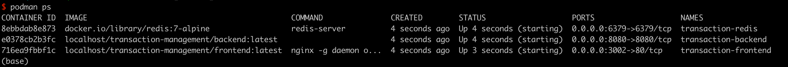
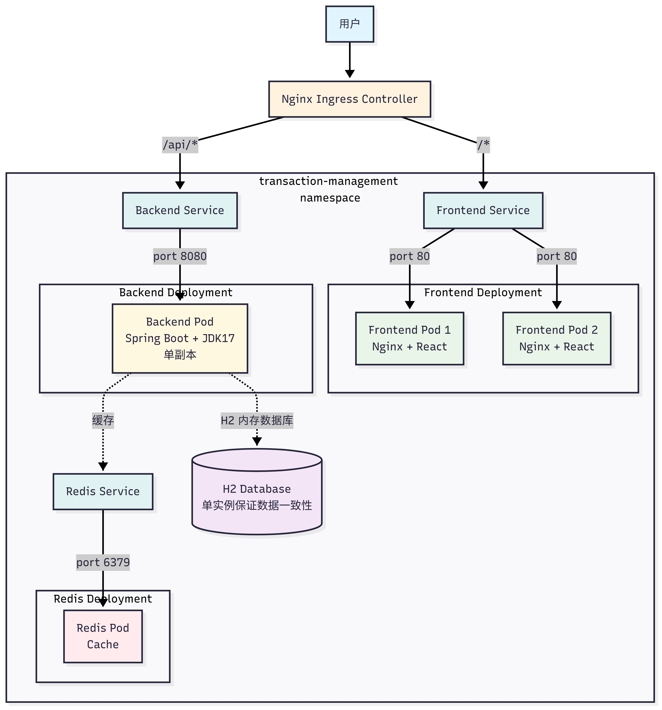

# 交易管理系统

基于Spring Boot后端构建的简单交易管理系统，提供交易管理的基本CRUD操作。

## 审题
### 1. Write in Java 17 and Spring Boot
单体应用，SpringBoot 3.2.x 版本，Java 17 版本。

### 2. The primary entity is the transaction
这边我只做了 transaction 这个实体，其他的从提示里看不出来

### 3. All data should be held in memory database
`memory database` 我这边用的是 `H2` 数据库，内存数据库，重启后数据会丢失。

### 4. Key points to address are:
* 核心性能方面：用了Redis做缓存，用了深分页，加了缓存
* 测试方面：单元测试+压测（纯读+混合读写场景）
* 容器化部署：`podman-compose`
* 缓存机制：在交易查询接口加了缓存，用 `TransactionSynchronization` 强制在事务提交后才删缓存
* 验证和异常处理：
  * 用 `@Valid` 验证请求参数
  * 用 `@ExceptionHandler` 处理异常
  * 用自定义 `ErrorCode` 定义异常状态码
* 高效查询和分页：加了索引，深分页用的是嵌套子查询
* 遵循 RESTful API 设计原则

### 5. Ensure page functionalities: adding, modifying, deleting transactions, displaying the transaction list on the page
* 前端：用 React 写的简单页面，用 `axios` 调用后端 API

### 6. CRUD operations (create, delete, modify, listAll)
只写了最基础的 CRUD，题目中没有提到查询筛选之类的

### 7. 异常处理，重复交易，不存在的交易
处理了

### 8. If relevant, handle and test the logic for transaction types or categories
题目中没有提到交易类型，我加了一个这个字段，仅用于展示，没有在 CRUD 中起到什么作用

## 接口定义

基础路径：`/api/transactions`

### 1. 查询交易列表
```
GET /api/transactions?page=0&size=10
```
**参数：**
- page: 页码，从0开始（可选，默认0）
- size: 每页数量（可选，默认10）

**返回：** 分页的交易列表

### 2. 查询单个交易
```
GET /api/transactions/{transactionId}
```
**参数：**
- transactionId: 交易ID

**返回：** 交易详情

### 3. 创建交易
```
POST /api/transactions/create
```
**请求体：**
```json
{
  "amount": 100.50,
  "transactionType": 1,
  "accountNumber": "123456789",
  "counterpartyAccount": "987654321",
  "description": "转账"
}
```
注意：这里如果没有提供 transactionId ，就会自己创建一个

### 4. 更新交易
```
POST /api/transactions/update
```
**请求体：**
```json
{
  "transactionId": "TXN123",
  "amount": 200.00,
  "transactionType": 2,
  "accountNumber": "123456789",
  "description": "更新后的描述"
}
```

### 5. 删除交易
```
POST /api/transactions/delete
```
**请求体：**
```json
{
  "transactionId": "TXN123"
}
```

## 测试
### 单元测试
单元测试使用 JUnit 5 进行编写，测试覆盖率报告由 JaCoCo 生成。

```bash
cd backend
mvn test jacoco:report
```

报告会在 `target/site/jacoco` 目录下生成，打开 `index.html` 即可查看。



### 性能测试
利用 Apache Bench (ab) ，详见 `performance-tests/README.md`

## 本地开发

如果需要在本地环境运行项目进行开发：

### 后端

```bash
cd backend
mvn spring-boot:run
```

后端服务将在 http://localhost:8080 启动
注意：本地开发时需要先启动 Redis 服务。

### 前端

```bash
cd frontend
npm install
npm run dev
```

前端开发服务器将在 http://localhost:3001 启动


## 容器化部署说明

- **frontend**：由 Nginx 提供服务的 React 应用，运行在 3002 端口
- **backend**：Spring Boot API，运行在 8080 端口
- **redis**：Redis 缓存，运行在 6379 端口

### 构建脚本

`build-images.sh` 脚本用于构建后端和前端镜像：

```bash
# 构建所有镜像（latest 和 1.0.0 标签）
./build-images.sh
```

### 使用 Podman Compose
条件
- 已安装 Podman 和 Podman Compose
- 端口 3002、8080 和 6379 可用

1. 克隆仓库：
   ```bash
   git clone <repository-url>
   cd hsbc-homework
   ```

2. 使用提供的脚本构建镜像：
   ```bash
   cd deploy
   ./build-images.sh
   ```

3. 启动所有服务：
   ```bash
   podman-compose -f podman-compose.yml up -d
   ```



4. 访问应用：
   - 前端：http://localhost:3002
   - 后端API：http://localhost:8080
   - Redis：localhost:6379

5. 停止应用：
   ```bash
   podman-compose -f podman-compose.yml down
   ```

### 部署到 Kubernetes
条件
* 已经安装 Nginx Ingress Controller
* 镜像已推送到仓库

整体如图所示




#### 创建 Namespace
```yaml
apiVersion: v1
kind: Namespace
metadata:
  name: transaction-management
```

#### Redis 建议可靠的实例
略

#### 后端
```yaml
apiVersion: apps/v1
kind: Deployment
metadata:
  name: backend
  namespace: transaction-management
spec:
  # 注意，因为用了 H2，所以数据不一致，这里 replicas 设为 1
  replicas: 1
  selector:
    matchLabels:
      app: backend
  template:
    metadata:
      labels:
        app: backend
    spec:
      containers:
      - name: backend
        image: transaction-management/backend:latest
        ports:
        - containerPort: 8080
        env:
        - name: SPRING_REDIS_HOST
          value: "redis"
        - name: SPRING_REDIS_PORT
          value: "6379"
        - name: SERVER_PORT
          value: "8080"
        resources:
          requests:
            memory: "1024Mi"
            cpu: "500m"
          limits:
            memory: "2048Mi"
            cpu: "2000m"
        livenessProbe:
          httpGet:
            path: /api/actuator/health
            port: 8080
          initialDelaySeconds: 30
          periodSeconds: 10
        readinessProbe:
          httpGet:
            path: /api/actuator/health
            port: 8080
          initialDelaySeconds: 20
          periodSeconds: 5
---
apiVersion: v1
kind: Service
metadata:
  name: backend
  namespace: transaction-management
spec:
  selector:
    app: backend
  ports:
  - port: 8080
    targetPort: 8080
  type: ClusterIP
```

### 前端
```yaml
apiVersion: apps/v1
kind: Deployment
metadata:
  name: frontend
  namespace: transaction-management
spec:
  replicas: 2
  selector:
    matchLabels:
      app: frontend
  template:
    metadata:
      labels:
        app: frontend
    spec:
      containers:
      - name: frontend
        image: transaction-management/frontend:latest
        ports:
        - containerPort: 80
        resources:
          requests:
            memory: "256Mi"
            cpu: "200m"
          limits:
            memory: "512Mi"
            cpu: "1000m"
---
apiVersion: v1
kind: Service
metadata:
  name: frontend
  namespace: transaction-management
spec:
  selector:
    app: frontend
  ports:
  - port: 80
    targetPort: 80
  type: ClusterIP
```

### Ingress
```yaml
apiVersion: networking.k8s.io/v1
kind: Ingress
metadata:
  name: transaction-management-ingress
  namespace: transaction-management
  annotations:
    nginx.ingress.kubernetes.io/rewrite-target: /
spec:
  rules:
  - host: changeit
    http:
      paths:
      - path: /api
        pathType: Prefix
        backend:
          service:
            name: backend
            port:
              number: 8080
      - path: /
        pathType: Prefix
        backend:
          service:
            name: frontend
            port:
              number: 80
```

## 总结
正式做项目的时候，很多设计都不是这么做的，包括但不限于
1. 不会用 H2 数据库，会用 MySQL 等可靠的数据库
2. 后端配置不会完全用 yaml，还会引入配置中心
3. 后端会根据具体情况选择合适的限流策略，这里没有做
4. 真实项目不存在交易的 CRUD，甚至有很多业务限制，题目未提及，所谓未实现
5. 前端会做资源CDN，这里没有
6. 前端会用独立 api 域名访问后端，工程里为了便于本地跑没有配置

